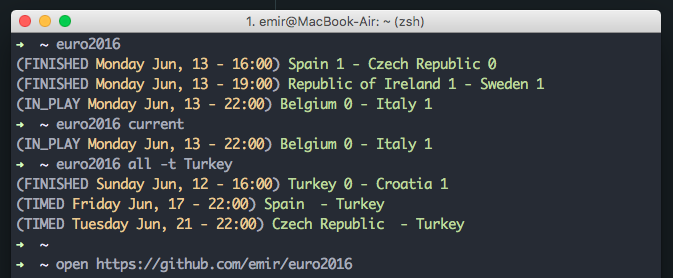

Euro2016
=================

UEFA EURO 2016 results for hackers.

[http://api.football-data.org/index](http://api.football-data.org/index)

Data Source: [http://api.football-data.org/v1/soccerseasons/424](http://api.football-data.org/v1/soccerseasons/424)




### Installing

After cloning the repository:

```
composer install
```

**Important: You should set date.timezone on your php.ini**


Usage
------------

`php app.php fixtures`

Default argument is today. Also **current**, **finished** and **all** are supported arguments.
With argument **all** you can specified team you want to see schedule/results. For example:

`php app.php fixtures all -t Turkey`

You can always add **euro2016** alias on your .bashrc or .zshrc (That's how I use)

`alias euro2016='php projects/euro2016/app.php fixtures'`

and use like this:

`euro2016 current`

License
-------------

[MIT License](http://emir.mit-license.org/)
